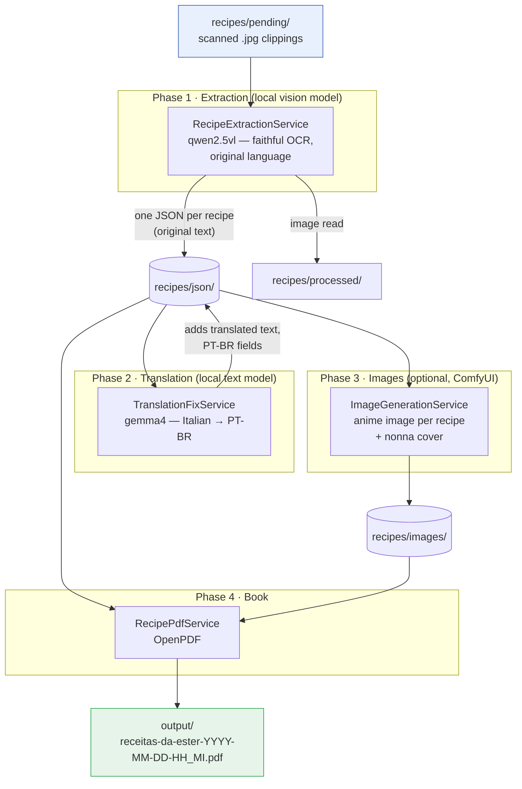

# ester-recipes

A Spring Boot + Spring AI app that turns a pile of **scanned cooking-recipe clippings**
(Italian and Brazilian Portuguese, often several recipes per image, frequently rotated)
into a single, illustrated **PDF cookbook** — *"Receitas da Ester"* — fully in Brazilian
Portuguese, using only **local models** (Ollama + ComfyUI).

For each recipe it writes one JSON file (title, category, ingredients, steps, the verbatim
`original` text and its Portuguese `translated` text) and renders a polished PDF: two
recipes per page, a small anime image per dish, a clickable index, and a category summary.

> 🇧🇷 Versão em português: **[README.pt-BR.md](README.pt-BR.md)**

Built on **Spring Boot 3.5.14** and **Spring AI 1.1.3** (Java 21+).

## How it works

The pipeline runs in phases so the 8 GB GPU only ever hosts one model at a time:



1. **Extraction** — `RecipePipeline` scans `recipes/pending/`, skipping anything already in
   `recipes/processed/`. Each image goes to the Ollama **vision model** (`qwen2.5vl`), which
   transcribes it **faithfully in the original language** (no translation). A JSON schema is
   passed as Ollama's `format`, so output is grammar-constrained to `{ "recipes": [ ... ] }`.
   One JSON per recipe is written; the image is moved to `processed/`.
2. **Translation** — `TranslationFixService` sends every non-Portuguese recipe to a stronger
   **text model** (`gemma4`) for a clean Brazilian-Portuguese translation. Each recipe keeps
   both its `original` (verbatim) and `translated` text. This phase is idempotent.
3. **Images (optional)** — `ImageGenerationService` asks a local **ComfyUI** server for one
   small anime image per recipe (food only, no people) plus a bigger cover of an Italian
   *nonna* surrounded by every food category.
4. **Book** — `RecipePdfService` (OpenPDF) builds the cookbook from all JSON: two recipes per
   page with their images, a clickable index, a per-category summary, sorted by category.

The batch is **resilient**: failures are logged and retried in rounds until every image is
processed; runs are resumable (processed images are skipped); each run writes a timestamped
log to `output/`.

## Requirements

- **Java 21+** (built/tested on JDK 25), **Maven 3.9+**
- **Ollama** at `http://localhost:11434`, with the models pulled:
  ```bash
  ollama pull qwen2.5vl:3b   # vision / OCR (fast, fits an 8 GB GPU)
  ollama pull gemma4         # translation (stronger text model)
  ollama pull qwen2.5vl:7b   # optional: for dense pages the 3b struggles with
  ```
- **Docker** + the **NVIDIA Container Toolkit** — only for the optional image phase (ComfyUI).

## Run

Put your scans in `recipes/pending/` (two samples are included), then:

```bash
# Phase 1+2 — extract + translate, then build the PDF
mvn spring-boot:run -Dspring-boot.run.arguments="--ester.translation.enabled=true"

# Phase 3 — generate the anime images (after ComfyUI is up), then rebuild the PDF
mvn spring-boot:run -Dspring-boot.run.arguments="--ester.images.enabled=true"
```

Outputs:

| Path | Contents |
|------|----------|
| `recipes/json/<categoria>-<titulo>.json` | one JSON per recipe (`original` + `translated`) |
| `recipes/processed/` | images already read (skipped on re-runs) |
| `recipes/images/<stem>.png` | one small anime image per recipe + `_cover.png` |
| `output/receitas-da-ester-YYYY-MM-DD-HH_MI.pdf` | the illustrated cookbook |
| `output/process-YYYY-MM-DD_HH_MM_SS.log` | full log of each run |

Build a runnable jar instead: `mvn clean package && java -jar target/ester-recipes-1.0.0.jar`.

## Configuration (`src/main/resources/application.yml`)

| Key | Default | Meaning |
|-----|---------|---------|
| `spring.ai.ollama.chat.options.model` | `qwen2.5vl:3b` | vision / OCR model |
| `spring.ai.ollama.chat.options.num-ctx` / `num-predict` | `8192` / `8192` | context + output caps (keep the model on-GPU, bound runaway) |
| `ester.input-dir` | `./recipes/pending` | folder scanned for images |
| `ester.concurrency` | `1` | images processed in parallel (virtual threads) |
| `ester.translation.enabled` / `.model` | `false` / `gemma4:latest` | the translation phase |
| `ester.images.enabled` / `.base-url` / `.checkpoint` | `false` / `localhost:8188` / … | the ComfyUI image phase |
| `ester.pdf-title` | `Receitas da Ester` | cover title |

## Image generation (ComfyUI)

One-time: install the toolkit, drop a free anime checkpoint into `comfyui/models/checkpoints/`,
and start the container:

```bash
sudo apt-get install -y nvidia-container-toolkit
sudo nvidia-ctk runtime configure --runtime=docker && sudo systemctl restart docker
# put e.g. an SD 1.5 anime model in comfyui/models/checkpoints/ and set ester.images.checkpoint
docker compose up -d        # ComfyUI API on http://localhost:8188
```

The recipe images are small and people-free; the cover is the *nonna* spread. Generated
images are downscaled and embedded as compact JPEGs, so a 400-recipe book is only ~6 MB.

## Project layout

```
model/Recipe.java                    one recipe (incl. original + translated text)
model/StoredRecipe.java              recipe + its JSON file stem (links to its image)
config/EsterProperties.java          @ConfigurationProperties("ester")
service/RecipeExtractionService.java vision OCR, faithful, schema-constrained
service/TranslationFixService.java   gemma4 translation phase (idempotent)
service/CategoryNormalizer.java      canonical PT-BR categories (no "Outras")
service/ImageGenerationService.java  ComfyUI image + cover generation
service/ComfyUiClient.java           minimal ComfyUI HTTP client
service/RecipeJsonStore.java         read/write per-recipe JSON
service/RecipePipeline.java          orchestrates the phases
pdf/RecipePdfService.java            two-per-page PDF, clickable index, summary, cover
```

The exact requirements this implements live in [`agents.md`](agents.md).

## Known limitations

- **Dense multi-recipe pages** can defeat the 3B model (it truncates/loops). Re-run just
  those through `qwen2.5vl:7b` (`--spring.ai.ollama.chat.options.model=qwen2.5vl:7b`).
- **Translation quality** depends on the model. Small local models land ~85–90%; a few
  Italian dish-names may survive. Set a stronger `ester.translation.model` for better results.
- **OCR quality** depends on the scan; the clippings are old/rotated. Spot-check important recipes.
