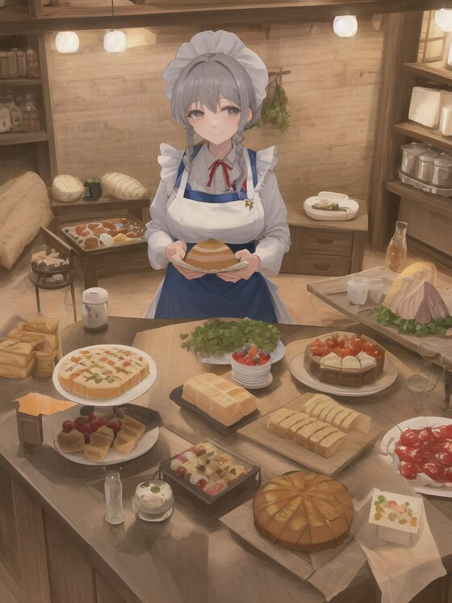
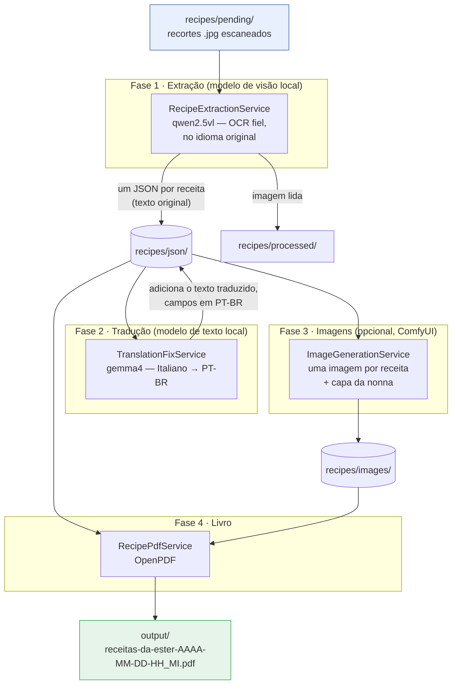

# ester-recipes

<p align="center">
  
</p>

Um aplicativo Spring Boot + Spring AI que transforma uma pilha de **recortes de receitas
escaneados** (em italiano e português do Brasil, muitas vezes com várias receitas por
imagem e frequentemente girados) em um único **livro de receitas em PDF** — *"Receitas da
Ester"* — totalmente em português do Brasil, usando apenas **modelos locais** (Ollama +
ComfyUI).

Para cada receita ele grava um arquivo JSON (título, categoria, ingredientes, modo de
preparo, o texto `original` literal e o texto `translated` em português) e gera um PDF
caprichado: duas receitas por página, uma pequena imagem estilo anime por prato, um índice
clicável e um resumo por categoria.

> 🇬🇧 English version: **[README.md](README.md)**

Construído com **Spring Boot 3.5.14** e **Spring AI 1.1.3** (Java 21+).

## Como funciona

O processamento ocorre em fases, para que a GPU de 8 GB hospede apenas um modelo por vez:



1. **Extração** — `RecipePipeline` varre `recipes/pending/`, pulando o que já está em
   `recipes/processed/`. Cada imagem vai para o **modelo de visão** do Ollama (`qwen2.5vl`),
   que a transcreve **fielmente no idioma original** (sem traduzir). Um schema JSON é passado
   como `format` do Ollama, então a saída é restrita a `{ "recipes": [ ... ] }`. Um JSON por
   receita é gravado; a imagem é movida para `processed/`.
2. **Tradução** — `TranslationFixService` envia cada receita não-portuguesa a um **modelo de
   texto** mais forte (`gemma4`) para uma tradução limpa em português do Brasil. Cada receita
   mantém o texto `original` (literal) e o `translated`. Esta fase é idempotente.
3. **Imagens (opcional)** — `ImageGenerationService` pede a um servidor **ComfyUI** local uma
   pequena imagem estilo anime por receita (só comida, sem pessoas), além de uma capa maior
   de uma *nonna* italiana cercada por todas as categorias de comida.
4. **Livro** — `RecipePdfService` (OpenPDF) monta o livro a partir de todos os JSON: duas
   receitas por página com suas imagens, índice clicável, resumo por categoria, ordenado.

O lote é **resiliente**: falhas são registradas e repetidas em rodadas até que toda imagem
seja processada; as execuções são retomáveis (imagens processadas são puladas); cada
execução grava um log com data/hora em `output/`.

## Pré-requisitos

- **Java 21+** (testado no JDK 25), **Maven 3.9+**
- **Ollama** em `http://localhost:11434`, com os modelos baixados:
  ```bash
  ollama pull qwen2.5vl:3b   # visão / OCR (rápido, cabe em uma GPU de 8 GB)
  ollama pull gemma4         # tradução (modelo de texto mais forte)
  ollama pull qwen2.5vl:7b   # opcional: para páginas densas que o 3b não dá conta
  ```
- **Docker** + o **NVIDIA Container Toolkit** — apenas para a fase opcional de imagens (ComfyUI).

## Executar

Coloque seus escaneamentos em `recipes/pending/`, depois:

```bash
# Fase 1+2 — extrai + traduz e gera o PDF
mvn spring-boot:run -Dspring-boot.run.arguments="--ester.translation.enabled=true"

# Fase 3 — gera as imagens anime (com o ComfyUI no ar) e reconstrói o PDF
mvn spring-boot:run -Dspring-boot.run.arguments="--ester.images.enabled=true"
```

Saídas:

| Caminho | Conteúdo |
|---------|----------|
| `recipes/json/<categoria>-<titulo>.json` | um JSON por receita (`original` + `translated`) |
| `recipes/processed/` | imagens já lidas (puladas nas reexecuções) |
| `recipes/images/<stem>.png` | uma imagem anime por receita + `_cover.png` |
| `output/receitas-da-ester-AAAA-MM-DD-HH_MI.pdf` | o livro de receitas ilustrado |
| `output/process-AAAA-MM-DD_HH_MM_SS.log` | log completo de cada execução |

Para gerar um jar executável: `mvn clean package && java -jar target/ester-recipes-1.0.0.jar`.

## Configuração (`src/main/resources/application.yml`)

| Chave | Padrão | Significado |
|-------|--------|-------------|
| `spring.ai.ollama.chat.options.model` | `qwen2.5vl:3b` | modelo de visão / OCR |
| `spring.ai.ollama.chat.options.num-ctx` / `num-predict` | `8192` / `8192` | limites de contexto e saída (mantêm o modelo na GPU e contêm loops) |
| `ester.input-dir` | `./recipes/pending` | pasta varrida em busca de imagens |
| `ester.concurrency` | `1` | imagens processadas em paralelo (virtual threads) |
| `ester.translation.enabled` / `.model` | `false` / `gemma4:latest` | a fase de tradução |
| `ester.images.enabled` / `.base-url` / `.checkpoint` | `false` / `localhost:8188` / … | a fase de imagens (ComfyUI) |
| `ester.pdf-title` | `Receitas da Ester` | título da capa |

## Geração de imagens (ComfyUI)

Uma vez só: instale o toolkit, coloque um checkpoint anime gratuito em
`comfyui/models/checkpoints/` e suba o contêiner:

```bash
sudo apt-get install -y nvidia-container-toolkit
sudo nvidia-ctk runtime configure --runtime=docker && sudo systemctl restart docker
# coloque um modelo SD 1.5 anime em comfyui/models/checkpoints/ e ajuste ester.images.checkpoint
docker compose up -d        # API do ComfyUI em http://localhost:8188
```

As imagens das receitas são pequenas e sem pessoas; a capa é a *nonna* com a fartura de
pratos. As imagens são reduzidas e embutidas como JPEGs compactos, então um livro de 400
receitas tem apenas ~6 MB.

## Estrutura do projeto

```
model/Recipe.java                    uma receita (inclui texto original + traduzido)
model/StoredRecipe.java              receita + o "stem" do arquivo JSON (liga à sua imagem)
config/EsterProperties.java          @ConfigurationProperties("ester")
service/RecipeExtractionService.java OCR de visão, fiel, restrito ao schema
service/TranslationFixService.java   fase de tradução com gemma4 (idempotente)
service/CategoryNormalizer.java      categorias canônicas em PT-BR (sem "Outras")
service/ImageGenerationService.java  geração de imagens e capa via ComfyUI
service/ComfyUiClient.java           cliente HTTP mínimo do ComfyUI
service/RecipeJsonStore.java         leitura/escrita do JSON por receita
service/RecipePipeline.java          orquestra as fases
pdf/RecipePdfService.java            PDF de duas por página, índice clicável, resumo, capa
```

Os requisitos exatos que isto implementa estão em [`agents.md`](agents.md).

## Limitações conhecidas

- **Páginas densas com várias receitas** podem derrotar o modelo 3B (ele trunca/entra em
  loop). Reprocesse só essas com o `qwen2.5vl:7b`
  (`--spring.ai.ollama.chat.options.model=qwen2.5vl:7b`).
- **A qualidade da tradução** depende do modelo. Modelos locais pequenos acertam ~85–90%;
  alguns nomes de pratos italianos podem sobrar. Configure um `ester.translation.model` mais
  forte para resultados melhores.
- **A qualidade do OCR** depende do escaneamento; os recortes são antigos/girados. Confira as
  receitas importantes.
